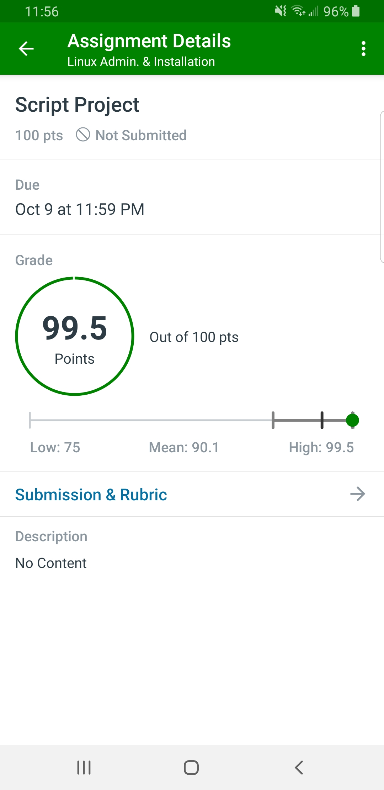

# Linux Final (2020)

This is an archival repository for my Linux Final exam from late 2020.

Written using Fedora.  
No formatting/edits have been made since submission. (Yeah, we go **HARD** in that size 4 tab game )

## Raw Notes

[My raw note sheet is attached here.](notes.txt)  

The following areas were obtained from the notes

## Requirements

I need a brand new script named master to be placed in the /root directory.  This script will initiate a multilevel menu environment.

This assignment will be graded on functionality, appearance, and ease of use.  Think like a user!!!!!  Someone should be able to set down and use this script correctly the first time.  Have fun.

The Fun menu is your opportunity to express your creativity!  Make it special.

### Random notes

(I have no idea what these are about...)

- SHOW COLOR CODING KEY? (ENABLE/DISABLE)
- DELETE GROUP OPTION?
- add search script OPTION
- RUN A SLEEP IN BACKGROUND (TESTING/DEBUGGING)
- MAYBE Move a process to the foreground option?

### Master Menu

- `1. File operations`
- `2. User Operations`
- `3. Locating information`
- `4. Process Menu`
- `5. Fun Menu`
- `88. Exit - FINISHED`
- `99. Shut down  - FINISHED`

#### The File Operations

- `1. Create a file`
- `2. Delete a file`
- `3. Create a directory`
- `4. Delete a directory`
- `5. Create a symbolic link`
- `6. Change ownership of a file`
- `7. Change permissions on a file`
- `8. Modify text within a file`
- `9. Copy a file`
- `10. Rename a file`
- `88. Return to main menu`
- `99. Shut down`

- `150. Change current working`

#### User Operations

- `1. Create a user`
- `2. Change the group for a user`
- `3. Create a group`
- `4. Delete a user`
- `5. Change a password`
- `88. Return to Main Menu`
- `99. Shut down`

#### Locating Information

- `1. Find text within a file`
- `2. Show information about a user account`
- `3. List the contents of a directory`
- `88. Return to Main Menu`
- `99. Shut down`

#### Process

- `1. Start a command with a defined nice level`
- `2. Change nice level of application`
- `3. View Processes`
- `4. Kill Processes`
- `5. Bring up Top`
- `6. Move a process to the background - BROKEN - NOT COLOURED`
	- How do you find the job id (`jobs -l`) of something done by another terminal?
	- YOU NEED a job ID for bg. Currently showing `jobs -l`
`88. Return to Main Menu`
`99. Shut down - FINISHED - COLORUED`

## Final Score

(The teacher famously did not give a full 100/100 to any student, and redacted .5 for fun)
